# Topic Modeling and Sentimental Analysis of Alzheimer's Caregivers on Online Forums

### 0415 - Update

- built a [shiny app dashboard](https://carol-cheng-98.shinyapps.io/alzheimers-topic-modeling/) for futher exploration
  - add representative documents for each topic
  - add wordcloud of topic words for each topic

- to do: 
  - add topic-metadata relationship section to the dashboard
  - ? overall topics and covariate topics not consistent
  - ? stm vs select

### 0330 - Progress report

- **Dataset**: the data was scraped from alzconnected.org and reddit. Up until now, we have only explore the initial posts on the forums. The documents were the <u>content</u> of the posts, and the metadata was the <u>source</u> (reddit/alzconnected) of the posts, and the <u>date</u> of the posts.

  - Reddit data: contains initial posts in the dementia and Alzheimer's subreddits
    - size: 9,069 observations
  - Alzconnected data: contains initial posts in the caregiver forum on Alizconnected.org
    - size: 33,132 observations

- **Models**: we explored the data primarily using the `stm` package with R, which is a tool to perform structural topic modeling. 

  - After cleaning the data, we first did a search on the number of topics K with the `searchK()` function.
    - The function runs `selectModel()` for different topic numbers and computes the exclusivity, remantic coherence, heldout likelihood, bound, lower bound, and residual dispersion for the returned model.
  - We chose the most appropriate K and fit the model for topic modeling. We used the `selectModel()` function and the `stm()` function.
    - The `selectModel()` function discards models with the low likelihood values based on a small number of EM iterations, and calculates semantic coherence, exclusivity, and sparsity of models given a specific K. We were able to choose the best model based on the coherence-exclusivity measure.
    - The `stm()` function performs the variational EM for structural topic model
  - We explored topic-metadata relationship using the `estimateEffect()` function on a learned model.

- **Results**: 

  - <u>Number of topics (K)</u>: we did a search on K with values = c(6,8,10,11,12,14,16,18,20,30), the diagonostic statistics is as followed:

    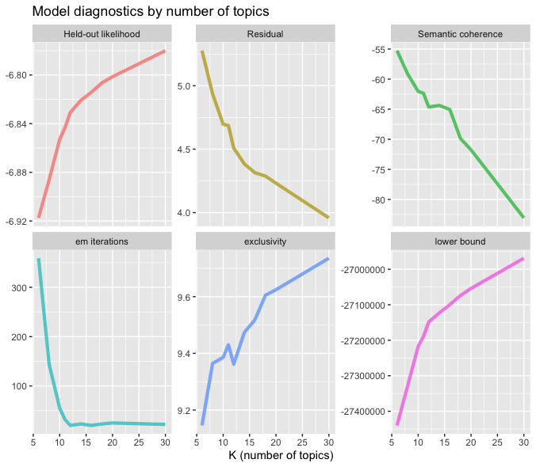

    The larger K is, the lower semantic coherence and the higher the exclusivity a model has. We trained one model for K = 20 and one for K = 30.

  - <u>Overall topics</u>:

    - K = 20

      - Candidate models diagnostic statistics after `selectModel()`: we selected model 3 for higher exclusivity for further exploration

        
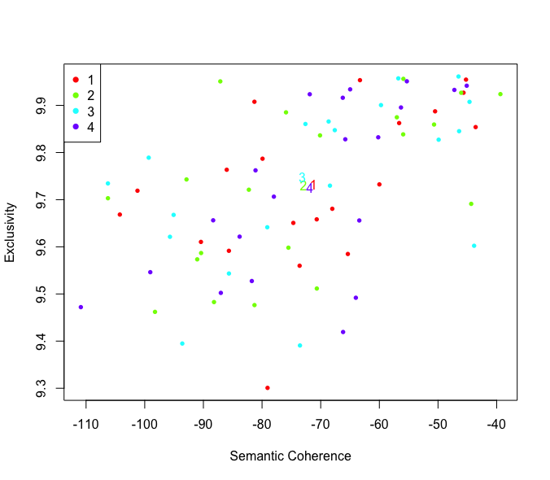
	

      - Expected topic proportions for model 3:

        
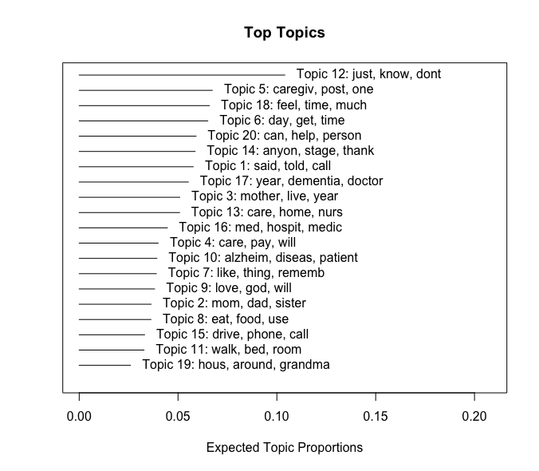
	

      - Expected topic proportions for model with `stm()`:

    
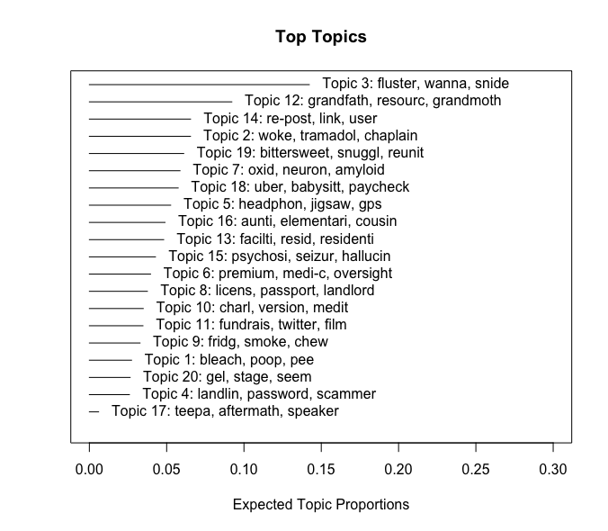
	

    - K = 30
      - Candidate models diagnostic statistics after `selectModel()`: we selected model 2 for higher exclusivity for further exploration

    
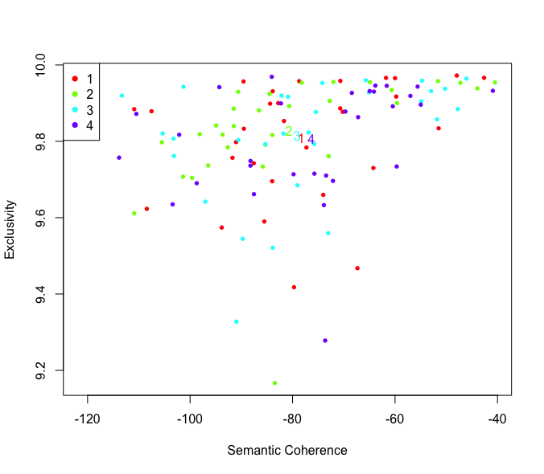
	

    - Expected topic proportions for model 2:

    
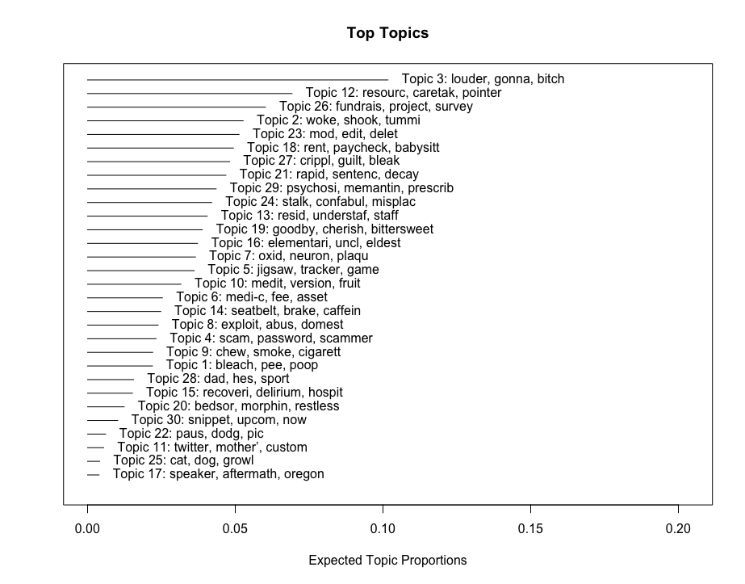
	

    - Expected topic proportions for model with `stm()`:

      

	

  - <u>Topic-metadata correlation</u>

    - k = 20

      - visualization of some topic words by source:

        
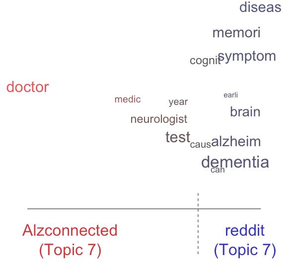
	 

        
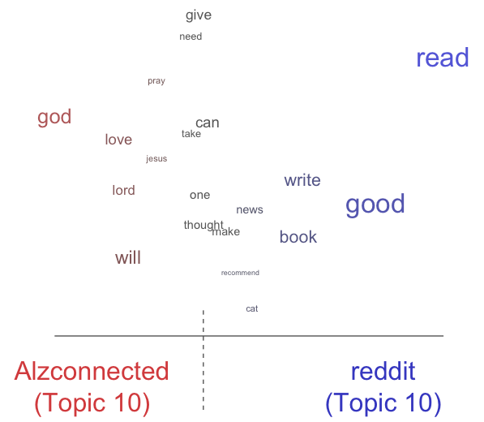
	 

        
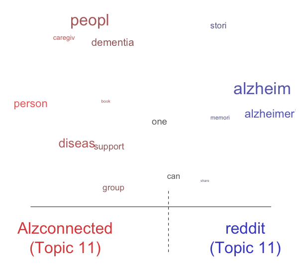
	 

      
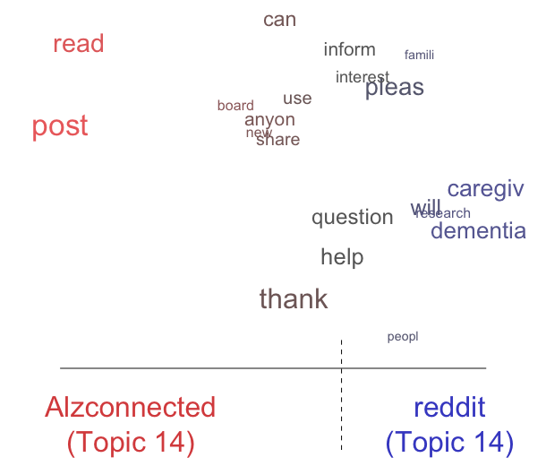
	 

      - Effect of covariates on topics

      
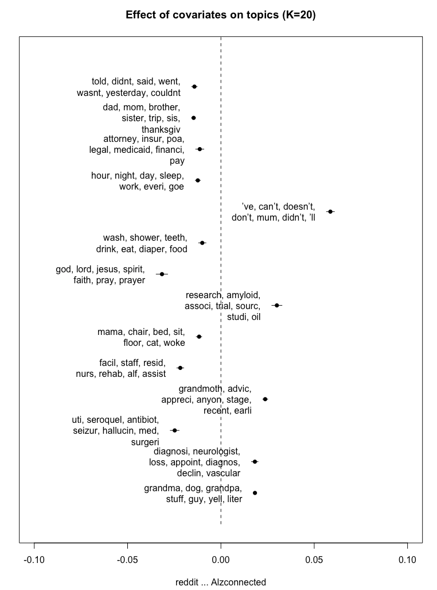
	

    - k = 30

      - Visualization of some topic words by source:

        
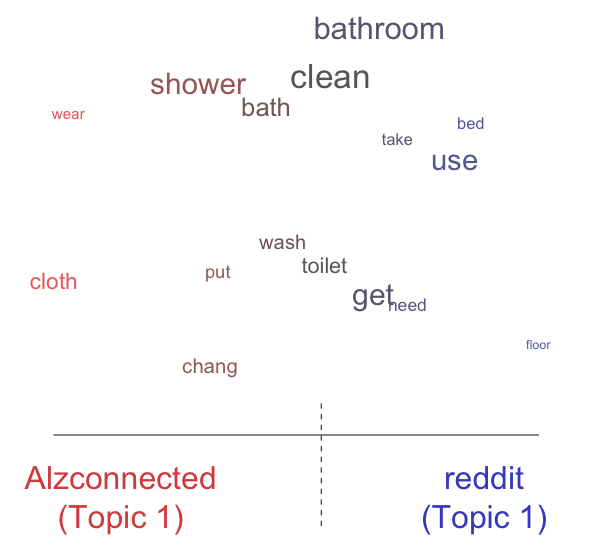
	 
  
        
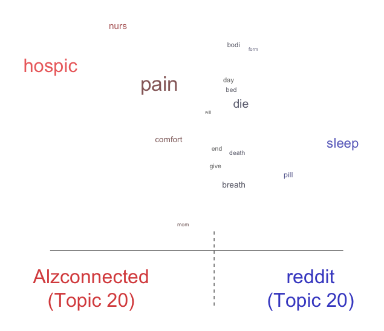
	 
  
      
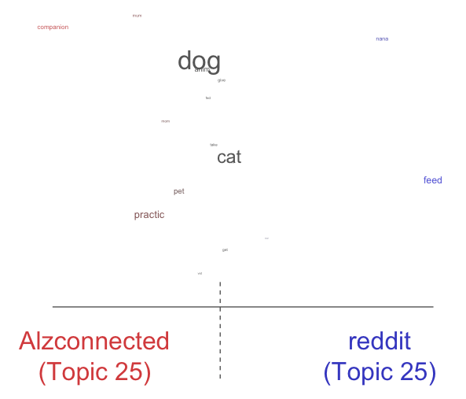
	 
      
      
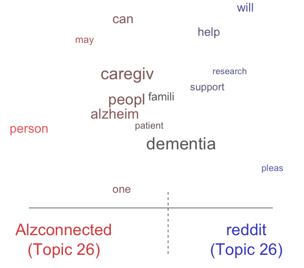
	 
      
      - Effect of covariates on topics:
  
  
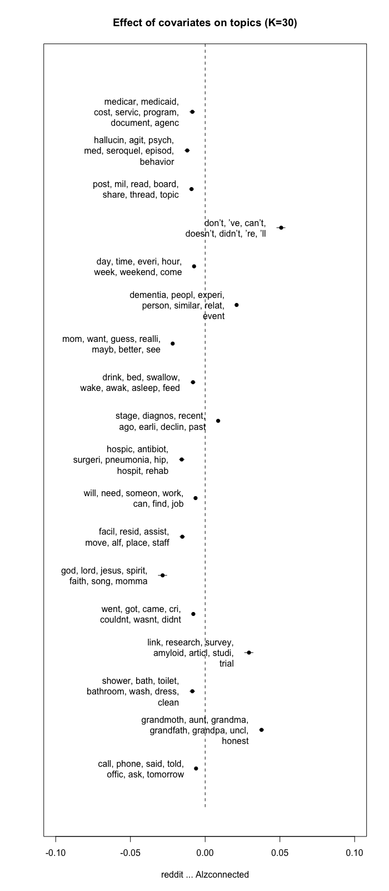
	
  
  

### Timeline

[x] 2/21 - 3/6: Finish the web crawler to acquire necessary data

[x] 3/7 - 4/1: Data preprocessing; topic modeling; identifiy questions to explore

[ ] 4/1 - 4/8: finish up topic modeling

[ ] 4/8 - 4/18: explore user interaction, etc.

[ ] 4/18 - 4/29: final report, presentation

